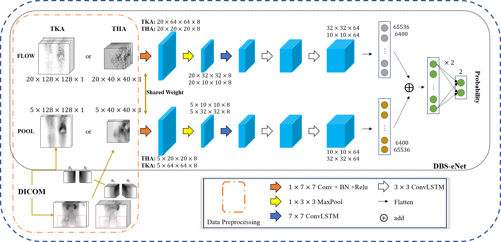

# An artificial intelligence framework for the diagnosis of prosthetic joint infection based on 99mTc‑MDP dynamic bone scintigraphy
> Liangbing Nie · Zhenkui Sun · Fengling Shan · Chengfan Li · Xuehai Ding · Chentian Shen\
> Received: 17 September 2022 / Revised: 30 January 2023 / Accepted: 26 February 2023\
> European Radiology, [https://doi.org/10.1007/s00330-023-09687-w](https://doi.org/10.1007/s00330-023-09687-w)

---
##  The framework that contains data preprocessing and DBS-eNet

---
